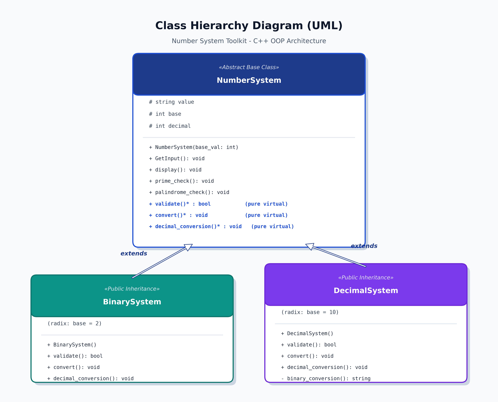
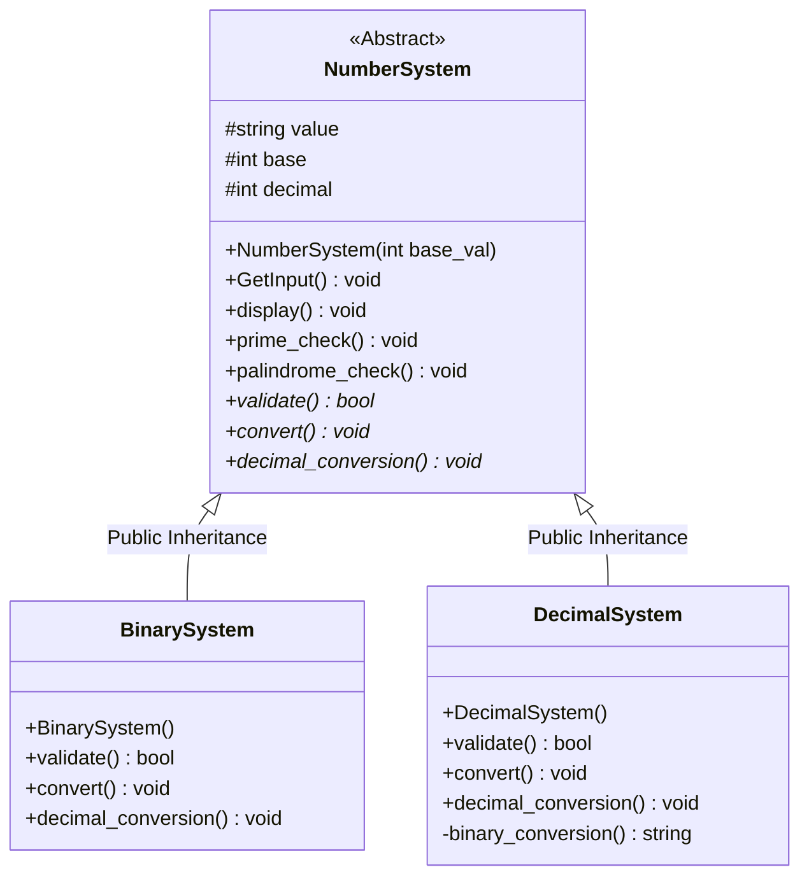
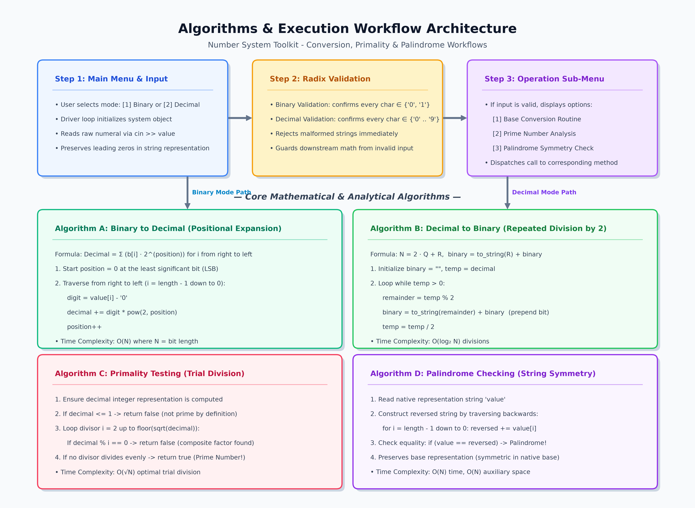

# 🔢 Number System Toolkit

A robust, menu-driven **Object-Oriented C++** application designed for number system conversions, character-level input validation, and mathematical property analysis (primality and palindrome checks).

Developed as an academic project for **Object-Oriented Programming with C++ (Semester III)**.

---

## 📋 Table of Contents

- [Overview](#overview)
- [Key Features](#key-features)
- [Object-Oriented Architecture](#object-oriented-architecture)
  - [OOP Concepts Applied](#oop-concepts-applied)
  - [Class Hierarchy Diagram](#class-hierarchy-diagram)
- [Detailed Code Walkthrough](#detailed-code-walkthrough)
  - [1. Abstract Base Class: `NumberSystem`](#1-abstract-base-class-numbersystem)
  - [2. Derived Class: `BinarySystem`](#2-derived-class-binarysystem)
  - [3. Derived Class: `DecimalSystem`](#3-derived-class-decimalsystem)
  - [4. Menu & Driver Logic: `main()` and `displayMenu()`](#4-menu--driver-logic-main-and-displaymenu)
- [Program Execution Flow](#program-execution-flow)
- [Algorithms & Mathematics](#algorithms--mathematics)
  - [Positional Notation (Binary to Decimal)](#positional-notation-binary-to-decimal)
  - [Repeated Division by 2 (Decimal to Binary)](#repeated-division-by-2-decimal-to-binary)
  - [Trial Division Primality Test](#trial-division-primality-test)
  - [Two-Pointer / String Reversal Palindrome Check](#two-pointer--string-reversal-palindrome-check)
- [Project Directory Structure](#project-directory-structure)
- [Compilation and Setup](#compilation-and-setup)
- [Sample Usage Walkthrough](#sample-usage-walkthrough)
- [Future Scope](#future-scope)

---

## 📖 Overview

The **Number System Toolkit** provides an interactive command-line environment to manipulate and convert numbers between different positional numeral systems (specifically **Binary (Base 2)** and **Decimal (Base 10)**). 

Beyond standard conversion, the toolkit allows users to analyze structural and mathematical properties of the entered values, including:
1. Validating strings against their expected alphabet/radix characters.
2. Checking if the value forms a **palindrome** in its native base.
3. Determining if the decimal equivalent is a **prime number**.

---

## ✨ Key Features

- **Bidirectional Conversions**:
  - Binary to Decimal conversion.
  - Decimal to Binary conversion.
- **Robust Input Validation**:
  - Prevents malformed inputs (e.g., rejecting non-binary digits in binary mode or non-digit characters in decimal mode) before performing any conversion.
- **Mathematical Property Checks**:
  - **Primality Testing**: Evaluates whether the decimal representation is prime using an optimized $O(\sqrt{N})$ trial division algorithm.
  - **Palindrome Testing**: Checks if the numeral representation reads symmetrically from left-to-right and right-to-left.
- **Menu-Driven CLI**:
  - Clean terminal interface with a continuous `do-while` loop, dynamic sub-menus, and graceful exit handling.

---

## 🏛️ Object-Oriented Architecture

The project leverages core principles of **Object-Oriented Programming (OOP)** in C++ to achieve clean modularity, code reuse, and extensibility.

### OOP Concepts Applied

| OOP Principle | Implementation in Code |
| :--- | :--- |
| **Abstraction** | The base class `NumberSystem` hides conversion and validation complexities behind an abstract contract using pure virtual functions (`validate() = 0`, `convert() = 0`, `decimal_conversion() = 0`). |
| **Encapsulation** | State variables (`value`, `base`, `decimal`) are kept under `protected` visibility to prevent direct external tampering while granting child classes direct access. Internal helper routines like `binary_conversion()` are marked `private`. |
| **Inheritance** | `BinarySystem` and `DecimalSystem` publicly inherit from `NumberSystem`, directly reusing common routines like `GetInput()`, `display()`, `prime_check()`, and `palindrome_check()`. |
| **Polymorphism** | Runtime polymorphism is established through virtual member functions. Each derived class overrides the validation and conversion behaviors specific to its base. |

### Class Hierarchy Diagram

<p align="center">
  
</p>

<details>
<summary><b>Click to expand Mermaid UML Specification</b></summary>


</details>

---

## 🔍 Detailed Code Walkthrough

The source code is located at [`Code/Number_System_Toolkit.cpp`](Code/Number_System_Toolkit.cpp). Below is a section-by-section explanation of each class, method, and algorithm.

### 1. Abstract Base Class: `NumberSystem`

Defined from lines 6 to 56:

```cpp
class NumberSystem
{
   protected:
      string value;
      int base;
      int decimal;
   public:
      NumberSystem(int base_val) {
         base = base_val;
         decimal = 0;
      }
      void GetInput(){ cin >> value; }
      void display(){ ... }
      void prime_check(){ ... }
      void palindrome_check(){ ... }
      virtual bool validate() = 0;
      virtual void convert() = 0;
      virtual void decimal_conversion() = 0;
};
```

#### Member Variables (`protected`)
- `string value`: Stores the literal number representation as a string. Storing it as a string is crucial because:
  - It allows character-by-character digit verification.
  - It preserves leading zeros if needed.
  - It prevents early numeric integer overflow before input validation.
  - It makes string traversal (such as palindrome checking) straightforward.
- `int base`: Stores the radix of the system (e.g., `2` for binary, `10` for decimal).
- `int decimal`: Holds the evaluated integer decimal equivalent of the number.

#### Member Functions (`public`)
- **`NumberSystem(int base_val)` (Constructor)**: Initializes the radix (`base`) with the value supplied by the derived class and initializes `decimal` to `0`.
- **`GetInput()`**: Reads the user's input string from standard input (`cin >> value`).
- **`display()`**: Outputs the current string value and its configured base to the console.
- **`prime_check()`**:
  1. Calls `decimal_conversion()` to ensure `decimal` is up to date.
  2. If `decimal <= 1`, the number is immediately classified as not prime (by definition of prime numbers).
  3. Otherwise, loops through integer divisors from `i = 2` up to $\lfloor\sqrt{\text{decimal}}\rfloor$:
     ```cpp
     for( int i = 2; i <= sqrt(decimal); i++ ){
        if( decimal % i == 0 ){
           prime = false;
           break;
        }
     }
     ```
  4. Prints whether the number is prime or not.
- **`palindrome_check()`**:
  1. Constructs a reversed version of `value` by traversing the string from the last index down to 0:
     ```cpp
     string reversed = "";
     for( int i = value.length() - 1; i >= 0; i-- ){
        reversed += value[i];
     }
     ```
  2. Compares `value == reversed`.
  3. Outputs whether the input numeral string is a palindrome.

#### Pure Virtual Functions
- `virtual bool validate() = 0;`: Forces each derived class to implement its own alphabet check.
- `virtual void convert() = 0;`: Forces each derived class to manage its own conversion and output display.
- `virtual void decimal_conversion() = 0;`: Forces each derived class to parse its string value into the base-10 integer `decimal`.

---

### 2. Derived Class: `BinarySystem`

Defined from lines 58 to 86:

```cpp
class BinarySystem : public NumberSystem
{
   public :
      BinarySystem() : NumberSystem(2){ }
      bool validate();
      void convert();
      void decimal_conversion();
};
```

#### Detailed Logic
- **Constructor (`BinarySystem() : NumberSystem(2)`)**: Uses constructor delegation to pass `base_val = 2` to `NumberSystem`.
- **`validate()`**:
  - Traverses `value` character-by-character.
  - Verifies that every character is either `'0'` or `'1'`.
  - Returns `false` upon encountering any invalid character; returns `true` otherwise.
- **`decimal_conversion()`**:
  - Evaluates the binary string to its decimal equivalent using positional weights.
  - Starts reading characters from the least significant digit (rightmost index `value.length() - 1`) to the most significant digit (index `0`).
  - Multiplies each digit `(value[i] - '0')` by $2^{\text{position}}$ using `pow(2, position)` and accumulates the result into `decimal`.
- **`convert()`**:
  - Invokes `decimal_conversion()`.
  - Calls `display()` to output the original binary number and base.
  - Displays the resulting decimal value.

---

### 3. Derived Class: `DecimalSystem`

Defined from lines 88 to 126:

```cpp
class DecimalSystem : public NumberSystem
{
   public :
      DecimalSystem() : NumberSystem(10){ }
      bool validate();
      void convert();
      void decimal_conversion();
   private :
      string binary_conversion();
};
```

#### Detailed Logic
- **Constructor (`DecimalSystem() : NumberSystem(10)`)**: Passes `base_val = 10` to `NumberSystem`.
- **`validate()`**:
  - Verifies that every character in `value` falls within the ASCII range `['0', '9']`.
  - Returns `false` if any non-numeric character is present.
- **`decimal_conversion()`**:
  - Parses the decimal string into the integer member variable `decimal`.
  - Uses an iterative Horner-like accumulation scheme:
    ```cpp
    decimal = 0;
    for( int i = 0; i < value.length(); i++ ){
       decimal = decimal * 10 + (value[i] - '0');
    }
    ```
- **`binary_conversion()` (`private`)**:
  - Encapsulates the algorithm to convert the integer `decimal` into its binary string equivalent.
  - Uses repeated modulus and integer division by 2:
    ```cpp
    string binary = "";
    int temp = decimal;
    while( temp > 0 ){
       int remainder = temp % 2;
       binary = to_string(remainder) + binary;
       temp /= 2;
    }
    ```
  - Prepending `to_string(remainder)` to `binary` ensures correct bit order from MSB to LSB.
- **`convert()`**:
  - Invokes `decimal_conversion()`, calls `binary_conversion()`, displays the original number and base, and outputs the resulting binary representation.

---

### 4. Menu & Driver Logic: `main()` and `displayMenu()`

Defined from lines 129 to 212:

- **`displayMenu()`**: Renders an ASCII banner and primary options:
  - `1. BINARY to DECIMAL`
  - `2. DECIMAL to BINARY`
  - `3. EXIT`
- **`main()` Function**:
  - Manages a continuous `do-while` loop driven by the user's input `choice`.
  - **Branch 1 (`case '1'` - Binary Operations)**:
    - Instantiates `BinarySystem b;`.
    - Prompts user and reads string into `b.GetInput()`.
    - Invokes `b.validate()`.
    - If valid, renders the sub-menu:
      - `1. Convert to Decimal` $\rightarrow$ calls `b.convert()`.
      - `2. Check Prime` $\rightarrow$ calls `b.prime_check()`.
      - `3. Check Palindrome` $\rightarrow$ calls `b.palindrome_check()`.
    - If invalid, prints `"Invalid Binary number!"`.
  - **Branch 2 (`case '2'` - Decimal Operations)**:
    - Instantiates `DecimalSystem d;`.
    - Prompts user and reads string into `d.GetInput()`.
    - Invokes `d.validate()`.
    - If valid, renders the sub-menu:
      - `1. Convert to Binary` $\rightarrow$ calls `d.convert()`.
      - `2. Check Prime` $\rightarrow$ calls `d.prime_check()`.
      - `3. Check Palindrome` $\rightarrow$ calls `d.palindrome_check()`.
    - If invalid, prints `"Invalid Decimal number!"`.
  - **Branch 3 (`case '3'` - Exit)**:
    - Prints a farewell message and exits the loop.
  - **Branch 'M' / 'm'**:
    - Re-displays the menu.
  - **Default**:
    - Handles invalid menu selections gracefully.

---

## 🔄 Program Execution Flow

<p align="center">
  
</p>

<details>
<summary><b>Click to expand Mermaid Execution Flowchart</b></summary>

```mermaid
flowchart TD
    Start([Program Start]) --> Menu[Display Main Menu]
    Menu --> InputChoice[/Input Choice: 1, 2, 3, M/]

    InputChoice -- Choice = '1' --> BinObj[Instantiate BinarySystem]
    BinObj --> BinInput[/Input Binary String/]
    BinInput --> BinVal{validate() == true?}
    BinVal -- No --> BinErr[Print: Invalid Binary number!] --> Menu
    BinVal -- Yes --> BinSubMenu[Display Binary Sub-Menu]
    BinSubMenu --> BinOp[/Select Sub-Option: 1, 2, 3/]
    BinOp -- '1' --> BinConv[convert() -> Positional Expansion]
    BinOp -- '2' --> BinPrime[prime_check() -> Decimal Primality]
    BinOp -- '3' --> BinPalin[palindrome_check() -> String Reverse]
    BinConv --> Menu
    BinPrime --> Menu
    BinPalin --> Menu

    InputChoice -- Choice = '2' --> DecObj[Instantiate DecimalSystem]
    DecObj --> DecInput[/Input Decimal String/]
    DecInput --> DecVal{validate() == true?}
    DecVal -- No --> DecErr[Print: Invalid Decimal number!] --> Menu
    DecVal -- Yes --> DecSubMenu[Display Decimal Sub-Menu]
    DecSubMenu --> DecOp[/Select Sub-Option: 1, 2, 3/]
    DecOp -- '1' --> DecConv[convert() -> Division by 2]
    DecOp -- '2' --> DecPrime[prime_check() -> Decimal Primality]
    DecOp -- '3' --> DecPalin[palindrome_check() -> String Reverse]
    DecConv --> Menu
    DecPrime --> Menu
    DecPalin --> Menu

    InputChoice -- Choice = '3' --> Exit([Print Exit Message & Terminate])
    InputChoice -- Choice = 'M'/'m' --> Menu
    InputChoice -- Other --> Default[Print Invalid Choice] --> Menu
```
</details>

---

## 🧮 Algorithms & Mathematics

### Positional Notation (Binary to Decimal)

For an $n$-bit binary string $B = b_{n-1}b_{n-2}\dots b_1b_0$, its decimal value is given by:

$$\text{Decimal} = \sum_{k=0}^{n-1} b_k \cdot 2^k$$

In [`BinarySystem::decimal_conversion()`](Code/Number_System_Toolkit.cpp), the string is read from right to left ($k=0$ up to $n-1$), converting character digits to numeric values via `(value[i] - '0')` and multiplying by $2^k$.

---

### Repeated Division by 2 (Decimal to Binary)

To convert an integer $N_{10}$ to binary:
1. Compute remainder $r = N \pmod 2$.
2. Prepend $r$ to the accumulator string.
3. Update $N \leftarrow \lfloor N / 2 \rfloor$.
4. Repeat until $N = 0$.

In [`DecimalSystem::binary_conversion()`](Code/Number_System_Toolkit.cpp), the loop constructs the binary string using `binary = to_string(remainder) + binary;`.

---

### Trial Division Primality Test

To determine if an integer $N > 1$ is prime:
- If $N \le 1$, $N$ is not prime.
- If $N$ has a non-trivial factor $a \times b = N$, at least one factor must be $\le \sqrt{N}$.
- Hence, testing divisors $i \in [2, \lfloor\sqrt{N}\rfloor]$ guarantees completeness in $O(\sqrt{N})$ time complexity.

Implemented in [`NumberSystem::prime_check()`](Code/Number_System_Toolkit.cpp).

---

### Two-Pointer / String Reversal Palindrome Check

A number is palindromic in a given base if its numeral sequence reads identically forward and backward:

$$S[i] = S[L - 1 - i], \quad \forall i \in [0, L-1]$$

Implemented in [`NumberSystem::palindrome_check()`](Code/Number_System_Toolkit.cpp) by building the reversed string and testing string equality (`value == reversed`).

---

## 📁 Project Directory Structure

```text
NumberSystemToolkit - Project/
│
├── Code/
│   ├── Number_System_Toolkit.cpp     # Complete C++ source code
│   └── Number_System_Toolkit.exe     # Compiled Windows executable
│
├── images/                           # Architecture & algorithm diagrams
│   ├── class_hierarchy.png           # UML Class Hierarchy diagram
│   └── algorithm_flowchart.png       # Execution flow & algorithm cards
│
├── Notes/                            # Project notes and documentation drafts
├── Report/                           # Academic report files
├── Reports/                          # Presentation / submission reports
├── scripts/                          # Diagram generator scripts (Python)
└── README.md                         # Comprehensive project documentation
```

---

## ⚙️ Compilation and Setup

### Prerequisites

- A C++ compiler supporting **C++11** or higher:
  - **GCC / MinGW** (`g++`)
  - **Clang** (`clang++`)
  - **Microsoft Visual C++** (`MSVC`)

### Compilation Commands

#### Using MinGW / GCC (Windows / Linux / macOS)

Open your terminal or PowerShell in the project root directory and execute:

```bash
# Navigate to the Code directory
cd Code

# Compile the source code using C++11 standard
g++ -std=c++11 Number_System_Toolkit.cpp -o Number_System_Toolkit.exe
```

#### Running the Application

- **On Windows (PowerShell / Command Prompt)**:
  ```powershell
  .\Number_System_Toolkit.exe
  ```
- **On Linux / macOS**:
  ```bash
  ./Number_System_Toolkit
  ```

---

## 💻 Sample Usage Walkthrough

### Example 1: Binary to Decimal and Prime Check

```text
==============================================
           NUMBER SYSTEM TOOLKIT              
==============================================
 MENU : 
        1. BINARY to DECIMAL
        2. DECIMAL to BINARY
        3. EXIT
==============================================
Enter your choice (M for MENU): 1
Enter Binary number: 1101
=================================
1. Convert to Decimal
2. Check Prime
3. Check Palindrome
=================================
Enter choice: 1
Converting to Decimal.....
Value in given Base: 1101
Base : 2
The Decimal value is : 13

Enter your choice (M for MENU): 1
Enter Binary number: 1101
=================================
1. Convert to Decimal
2. Check Prime
3. Check Palindrome
=================================
Enter choice: 2
13 is a Prime number!
```

---

### Example 2: Decimal to Binary and Palindrome Check

```text
Enter your choice (M for MENU): 2
Enter Decimal number: 121
=================================
1. Convert to Binary
2. Check Prime
3. Check Palindrome
=================================
Enter choice: 1
Converting to Binary.....
Value in given Base: 121
Base : 10
The Binary value is : 1111001

Enter your choice (M for MENU): 2
Enter Decimal number: 121
=================================
1. Convert to Binary
2. Check Prime
3. Check Palindrome
=================================
Enter choice: 3
121 is a Palindrome!
```

---

### Example 3: Input Validation Error Handling

```text
Enter your choice (M for MENU): 1
Enter Binary number: 10201
Invalid Binary number!

Enter your choice (M for MENU): 2
Enter Decimal number: 45A9
Invalid Decimal number!
```

---

## 🚀 Future Scope

1. **Additional Number Systems**:
   - Easily extendable to **Octal (Base 8)** and **Hexadecimal (Base 16)** by sub-classing `NumberSystem`.
2. **Floating-Point Number Support**:
   - Support fractional binary conversions (e.g., `101.101` $\rightarrow$ `5.625`).
3. **Negative Number & Signed Representations**:
   - Incorporate Two's Complement representation for negative binary values.
4. **Bitwise Operations**:
   - Add AND, OR, XOR, NOT, and bit-shift utility tools for binary representations.
5. **Arbitrary Precision Support**:
   - Implement custom BigInt logic to remove the maximum integer size constraint imposed by native 32-bit `int`.

---

## 👤 Author & Acknowledgments

- **Author**: Vamsi Kalyan
- **Course**: Object-Oriented Programming with C++ (OOP C++)
- **Semester**: III Semester B.Tech
